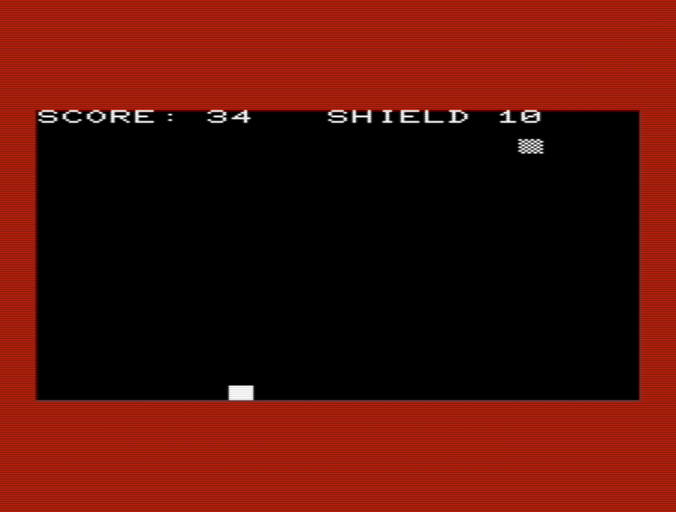
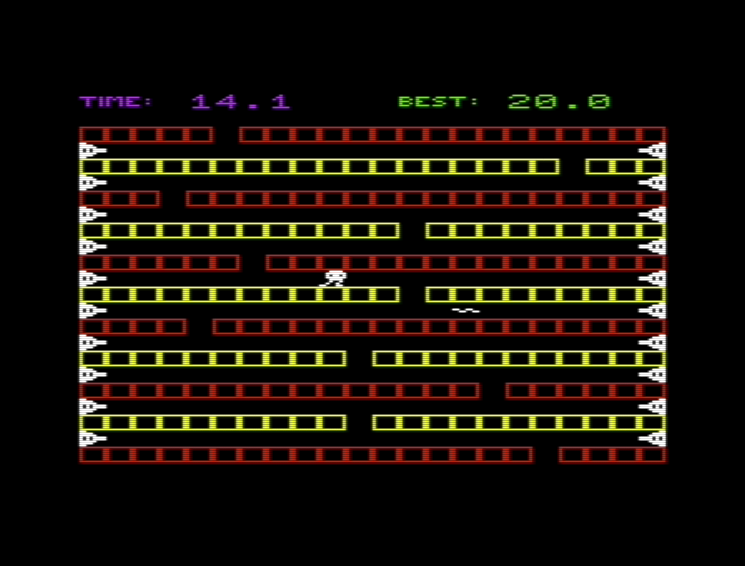
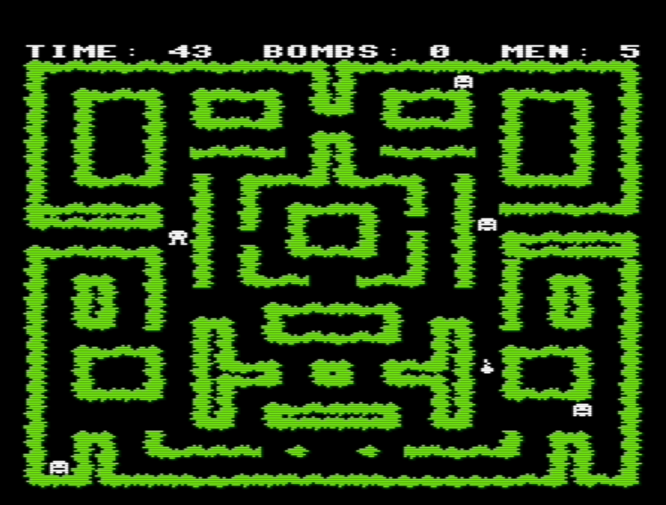
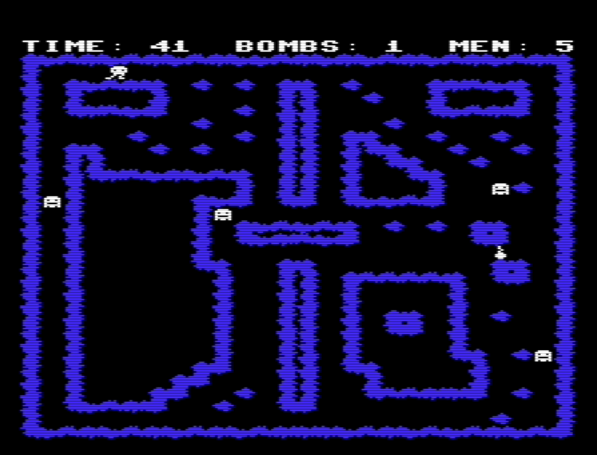

# Dusty tapes from the early 1980s

Here are the games I wrote for Commodore VIC-20 in 1984-1985. It is
amazing that I was able to restore the games from the tapes that have
been stored over 30 years in various places.

# Space Invader (1984)

This was my very first game. It is written entirely in BASIC.



## Instructions

```markdown
Controls:

A		Left
D		Right
RETURN		Fire
```

## Download

Download [space invader.prg.zip](space-invader/space invader.prg.zip) for
unexpanded VIC-20.

# Maze (1985)

The first idea was to make a maze game but during the development
the plans changed and the play field is not really a maze anymore.
However, the loading screen was created at early stage so I didn't
bother to change the name. At that time I did not have a character editor
so the graphics were made using paper, pen and calculator.
It was dedious work.

The game is written partly in basic and partly in machine language.
Originally it was a tape game and the high score table was saved on tape.
After 33 years I was still able to relearn basic and convert
loading and saving to disk instead. Enjoy!



## Instructions

```markdown
Controls:

Z		Left
M		Right
SPACE		Down
```

## Download

Download d64 disk image [maze(+3k).zip](maze/maze(+3k).zip) for VIC-20 with 3K memory expansion.

# Bomb Jack (1985)

This game has nothing to do with the game developed by Tehkan.
I just didn't know that game with the same name already existed.






## Instructions

Load the game from `Bomb_Jack_Game.tap.` After loading the game displays a screen where it says:

`Please reset tape counter to '000' and press FIRE`

Attach tap file `Bomb_Jack_Maps.tap` and press FIRE. Shortly after set tape to play mode.
The first game map should load now.

## Download

Download tap tape images [bombjack(+3k).zip](bombjack/bombjack(+3k).zip) for VIC-20 with 3K memory expansion and joystick.

