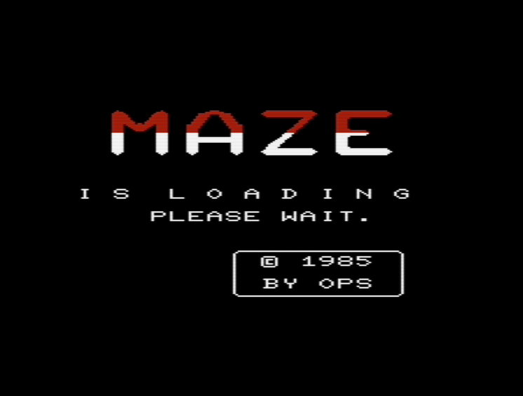
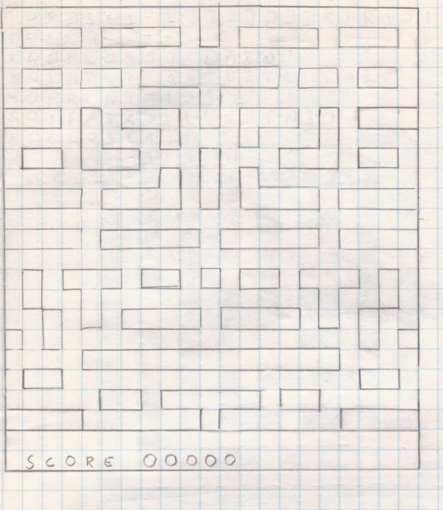
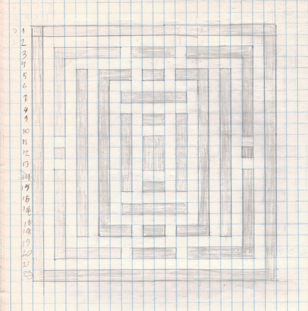
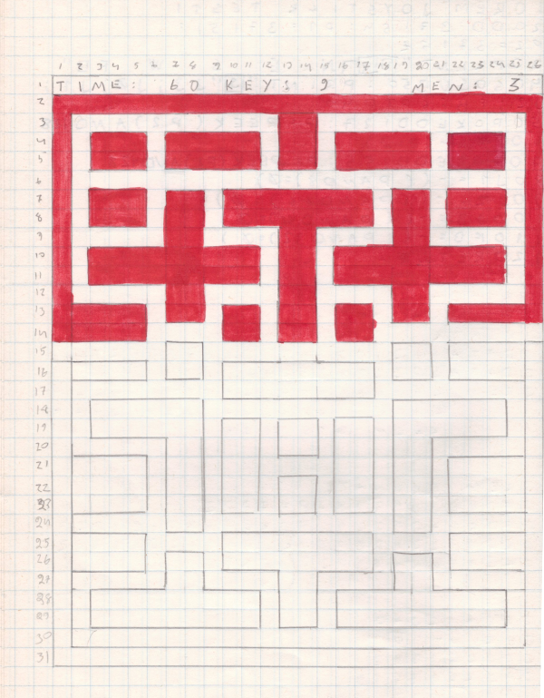
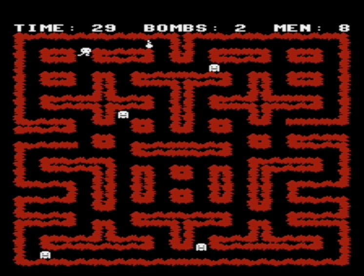
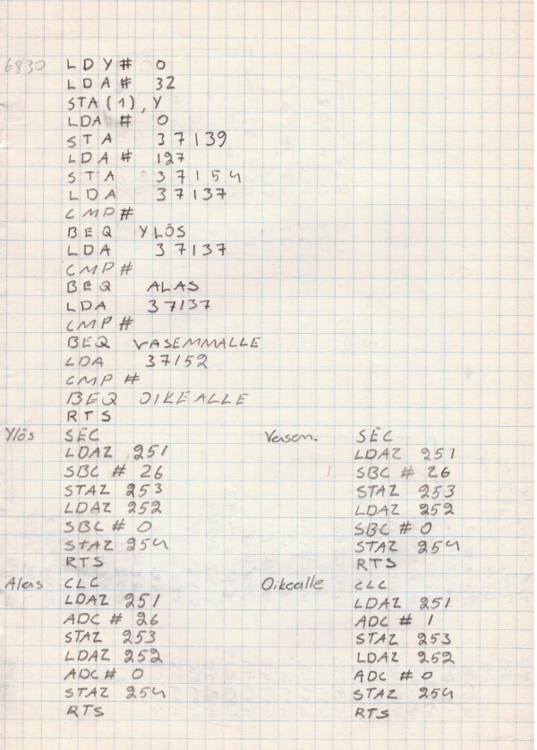

# Dusty tapes from the early 1980s

Here are the games I wrote for Commodore VIC-20 in 1984-1985. It is
amazing that I was able to restore the games from the tapes that have
been stored over 30 years in various places.

If you want to discuss these games please visit
[Denial Forum](http://sleepingelephant.com/ipw-web/bulletin/bb/viewtopic.php?t=9084).

# Space Invader (1984)

This was my very first game with simple PETSCII graphics. It is written
entirely in BASIC. I was just trying to learn how to move things on the
screen and detect if them collide. It has sound effects too!


## Instructions

```markdown
Controls:

A		Left
D		Right
RETURN		Fire
```

## Download

Download [space invader.prg.zip](space-invader/space invader.prg.zip) for
unexpanded VIC-20.

# Maze (1985)

The first idea was to make a maze game but during the development
the plans changed and the play field is not really a maze anymore.
However, the loading screen was created at early stage so I didn't
bother to change the name. At that time I did not have a character editor
so the graphics were made using paper, pen and calculator.
It was dedious work.



The game is written partly in BASIC and partly in machine language.
Originally it was a tape game and the high score table was saved on tape.
After 33 years I was still able to relearn CBM BASIC and convert
loading and saving to disk instead. Enjoy!


## Instructions

```markdown
Controls:

Z		Left
M		Right
SPACE		Down
```

## Download

Download d64 disk image [maze(+3k).zip](maze/maze(+3k).zip) for
VIC-20 with 3K memory expansion.

# Bomb Jack (1985)

This game has nothing to do with the game developed by Tehkan.
I just didn't know that game with the same name already existed.





Here is map design draft with extended screen resolution.



The same map from the game



The game has so many loaders that I gave up the idea of converting it to disk
image and it is now only provided as TAP images. Loading takes ages, sorry!
There is even bitmap loading screen made by a friend of mine with
his self made drawing tool.


The game is written partly in BASIC and partly in machine language. Some of
the ML routines are excuted as an IRQ routine.

I didn't have ML monitor at that time so coding was first done with
paper & pen and then POKEd to the memory. Here's some of my "coding"



Updated code

```
read_joy:
        lda     #$7F
        sta     VIA2_DDRB
        lda     VIA2_PB
        pha
        lda     #$FF
        sta     VIA2_DDRB
        pla
        and     #$80
        beq     pos_right
        lda     VIA1_PA2
        and     #$04
        beq     pos_up
        lda     VIA1_PA2
        and     #$08
        beq     pos_down
        lda     VIA1_PA2
        and     #$10
        beq     pos_left
        rts

pos_up:
        sec
        lda     $FB
        sbc     #MAP_X_SIZE
        sta     $FD
        lda     $FC
        sbc     #$00
        sta     $FE
        rts
pos_right:
        clc
        lda     $FB
        adc     #$01
        sta     $FD
        lda     $FC
        adc     #$00
        sta     $FE
        rts
pos_left:
        sec
        lda     $FB
        sbc     #$01
        sta     $FD
        lda     $FC
        sbc     #$00
        sta     $FE
        rts
pos_down:
        clc
        lda     $FB
        adc     #MAP_X_SIZE
        sta     $FD
        lda     $FC
        adc     #$00
        sta     $FE
        rts
```

It seems that I ran out of ideas for the main character since the same
guy is wobbling again in this game.


## Instructions

Load the game from `Bomb_Jack_Game.tap.` After loading the game displays
a screen where it says:

`Please reset tape counter to '000' and press FIRE`

Attach tap file `Bomb_Jack_Maps.tap` and press FIRE. Shortly after set tape
to play mode. The first game map should load now.

The game has 8 different maps. If you manage to complete all maps rewind
the tape and start from the map 1 again. The game was never really finshed so
it doesn't know how many maps the tape contains and it just keeps loading
the next map endlessly.

Press `FIRE` to pause/resume game playing.

## Download

Download tap tape images [bombjack(+3k).zip](bombjack/bombjack(+3k).zip) for
VIC-20 with 3K memory expansion and joystick.
